# 🚀 AI-Powered Project Management System

> Enterprise-grade SaaS project management platform with **12 integrated AI modules**, dual-mode AI architecture, and advanced automation capabilities

[](https://laravel.com)
[](https://php.net)
[](https://getbootstrap.com)
[](https://mysql.com)
[](LICENSE)

---

## 📋 Executive Summary

A **production-ready**, comprehensive project management system powered by Laravel 12 featuring an **advanced 12-module AI suite** that transforms how teams plan, execute, and optimize their projects. The system uniquely combines traditional rule-based AI with cutting-edge generative AI (GPT-4, Claude) in a dual-mode architecture, providing intelligent automation, predictive analytics, and self-learning capabilities.

### 🎯 What Makes This Unique

- **12 Integrated AI Modules** - Complete AI ecosystem from decision-making to security
- **Dual-Mode AI Architecture** - Switch between local rule-based and cloud generative AI
- **Self-Learning System** - AI improves accuracy through feedback loops (acceptance rate tracking)
- **Human-in-the-Loop** - All AI decisions require human approval (pending/accepted/rejected workflow)
- **29 User Documentation Files** - Comprehensive guides for every feature
- **50+ Frontend Libraries** - Modern, rich UI with advanced components
- **Production-Ready** - Battle-tested with 47 database migrations and 16 automated tests

### 🏢 Target Audience

- **Software Development Teams** - Agile project management with AI insights
- **Enterprise Organizations** - Scalable solution with RBAC and audit logging
- **Project Managers** - Intelligent workload balancing and risk prediction
- **Dev Teams** - Open-source, extensible architecture with full API access

---

## ✨ Core Features

### 🤖 AI Ecosystem - 12 Comprehensive Modules

<details>
<summary><b>1. AI Control Panel</b> - Central AI Management Hub</summary>

- System-wide AI enable/disable toggle
- AI provider management (Local, OpenAI, Claude)
- Real-time health monitoring
- System configuration dashboard
- Provider switching with live status

**Route:** `/admin/ai/control`  
**Documentation:** [AI Overview](docs/user-documentation/05-ai/01-ai-overview.md)
</details>

<details>
<summary><b>2. AI Decisions</b> - Decision Tracking & Workflow</summary>

- Complete decision history with audit trail
- Three-state workflow: Pending → Accepted/Rejected
- Confidence scoring (0.0 - 1.0)
- Bulk acceptance operations
- Decision modification capabilities
- Guardrail violation tracking

**Route:** `/admin/ai/decisions`  
**Documentation:** [AI Decisions](docs/user-documentation/05-ai/02-ai-decisions.md)
</details>

<details>
<summary><b>3. AI Prompts</b> - Template Management System</summary>

- Centralized prompt library with versioning
- Category and tag organization
- Prompt testing interface
- Active/inactive toggle for A/B testing
- System and custom prompts
- Quick test functionality

**Route:** `/admin/ai/prompts`  
**Documentation:** [AI Prompts](docs/user-documentation/05-ai/03-ai-prompts.md)
</details>

<details>
<summary><b>4. AI Analytics</b> - Advanced Insights Engine</summary>

- Custom analytics dashboards
- Real-time AI performance metrics
- Decision acceptance trends
- Confidence score distribution
- Export capabilities (PDF/Excel)
- Time-series analysis

**Route:** `/admin/ai/analytics`  
**Documentation:** [AI Analytics](docs/user-documentation/05-ai/04-ai-analytics.md)
</details>

<details>
<summary><b>5. AI Learning System</b> - Self-Improvement Engine</summary>

- Feedback loop integration
- Accuracy tracking over time
- Pattern recognition from user decisions
- Model performance visualization
- Learning curve analytics
- Adaptive confidence adjustment

**Route:** `/admin/ai/learning`  
**Documentation:** [AI Learning](docs/user-documentation/05-ai/05-ai-learning.md)
</details>

<details>
<summary><b>6. AI Security</b> - Protection & Compliance</summary>

- Rate limiting (100 actions/hour default)
- Input validation and sanitization
- XSS and SQL injection prevention
- Threat detection monitoring
- Security metrics dashboard
- Audit logging for all AI actions

**Route:** `/admin/ai/security`  
**Documentation:** [AI Security](docs/user-documentation/05-ai/06-ai-security.md)
</details>

<details>
<summary><b>7. AI Features</b> - Specialized AI Tools</summary>

Five powerful AI-driven features:

1. **Codebase Analysis** - Deep code structure analysis
2. **Development Plan Generation** - Auto-create project plans
3. **Project Breakdown** - Task decomposition and estimation
4. **Technical Study Creation** - Research and documentation generation
5. **Task Analysis** - Intelligent task evaluation

**Route:** `/admin/ai/features`  
**Documentation:** [AI Features](docs/user-documentation/05-ai/07-ai-features.md)
</details>

<details>
<summary><b>8. AI Reports</b> - Custom Report Generation</summary>

- Custom report builder
- Date range filtering
- PDF and Excel export
- Comparison reports
- Scheduled report generation
- Report templates library

**Route:** `/admin/ai/reports`  
**Documentation:** [AI Reports](docs/user-documentation/05-ai/08-ai-reports.md)
</details>

<details>
<summary><b>9. AI Workflows & Automation</b> - Rule-Based Automation</summary>

**5 Automated Triggers:**
- Overdue task detection
- Priority adjustment recommendations
- Resource allocation optimization
- Project health monitoring
- Custom rule evaluation

**4 Action Types:**
- Task reassignment
- Priority updates
- Deadline extensions
- Team notifications

**Advanced Features:**
- Scheduled AI analysis (database-backed)
- Batch processing (10+ tasks at once)
- Configurable workload threshold
- Automation rule builder

**Route:** `/admin/ai/workflows`  
**Documentation:** [AI Workflows](docs/user-documentation/05-ai/09-ai-workflows.md)
</details>

<details>
<summary><b>10. AI Integrations</b> - External Service Connections</summary>

**Supported Providers:**
- **OpenAI** - GPT-4, GPT-3.5-turbo support
- **Claude** - Anthropic Claude integration
- **Slack** - Webhook notifications
- **Custom Webhooks** - Extensible integration system

**Features:**
- Provider health checks
- Connection testing
- API key validation
- Real-time status monitoring

**Route:** `/admin/ai/integrations`  
**Documentation:** [AI Integrations](docs/user-documentation/05-ai/10-ai-integrations.md)
</details>

<details>
<summary><b>11. AI Performance</b> - Optimization & Monitoring</summary>

- Cache management (Redis support)
- Cache warm-up operations
- Query optimization suggestions
- Database index recommendations
- System metrics tracking
- Slow query detection
- Performance analytics

**Route:** `/admin/ai/performance`  
**Documentation:** [AI Performance](docs/user-documentation/05-ai/11-ai-performance.md)
</details>

<details>
<summary><b>12. AI Guardrails</b> - Safety & Threshold Management</summary>

- Confidence threshold settings (default: 0.7)
- Rate limiting configuration
- Safety rule management
- Violation tracking
- Fallback behavior configuration
- Emergency stop capabilities

**Route:** `/admin/ai/guardrails`  
**Documentation:** [AI Guardrails](docs/user-documentation/05-ai/12-ai-guardrails.md)
</details>

---

### 📊 Project Management Features

#### **Projects**
- ✅ Complete CRUD operations with rich metadata
- ✅ Status tracking (Completed, In Progress, Yet to Start, Cancelled)
- ✅ Priority levels (Low, Medium, High)
- ✅ Team lead assignment and multi-member teams
- ✅ Progress tracking with percentage visualization
- ✅ Project thumbnails and file attachments
- ✅ Deadline management with alerts
- ✅ Favorite projects toggle
- ✅ Advanced filtering and search

**Views:**
- Project list view with statistics
- Detailed project overview with tabs
- Team members panel
- Documents repository
- Project-specific tasks
- Activity timeline
- Discussion threads

**Route:** `/management/projects`  
**Documentation:** [Projects Guide](docs/user-documentation/02-projects/01-overview.md)

#### **Tasks**
- ✅ 7 task statuses (New, Pending, In Progress, Completed, On Hold, Review, Cancelled)
- ✅ Priority management (Low, Medium, High)
- ✅ Multiple assignee support
- ✅ Due date tracking with overdue indicators
- ✅ Progress percentage tracking
- ✅ Task dependencies
- ✅ Sub-tasks with completion toggles
- ✅ Task tags and categories
- ✅ Time entry logging
- ✅ File attachments
- ✅ Nested comments system

**Route:** `/management/tasks`  
**Documentation:** [Tasks Guide](docs/user-documentation/03-tasks/01-overview.md)

#### **Kanban Board** 🎯
- ✅ Visual drag-and-drop interface
- ✅ Real-time status updates via AJAX
- ✅ Position management within columns
- ✅ Add existing tasks to board
- ✅ Remove tasks from board view
- ✅ Quick task creation
- ✅ Column-based organization

**Route:** `/management/tasks/kanban`  
**Documentation:** [Kanban Board Guide](docs/user-documentation/03-tasks/02-kanban-board.md)

---

### 📈 Analytics & Reporting

#### **Real-time Dashboard**
- 📊 **Statistics Cards** - Active Projects, New Tasks, Total Hours, Team Size
- 📊 **Project Status Chart** - Donut chart with live data
- 📊 **AI Status Chart** - Pending/Accepted/Rejected decisions with confidence scores
- 📊 **Project Trends** - 12-month bar chart analysis
- 📊 **Upcoming Tasks Calendar** - Date-based task view with AJAX filtering
- 📊 **Team Performance** - Hours worked and task counts per member
- 📊 **Recent Activities** - Live activity feed with user attribution
- 📊 **Month-over-Month Comparison** - Trend indicators for all metrics

**Route:** `/dashboard`  
**Documentation:** [Dashboard Guide](docs/user-documentation/01-dashboard/01-overview.md)

---

### 🔔 Collaboration & Communication

- ✅ **Nested Comments** - Threaded discussions on projects and tasks
- ✅ **Activity Logging** - Complete audit trail with Spatie Activity Log
- ✅ **@Mentions** - Tag team members in comments
- ✅ **Email Notifications** - Automated alerts for events
- ✅ **Slack Integration** - Optional webhook notifications
- ✅ **Real-time Updates** - Dashboard auto-refresh
- ✅ **User Profiles** - Avatars and role badges
- ✅ **Team Member Directory** - Sortable team list

---

### 🔐 Security & Access Control

- ✅ **Spatie Permission** - Granular RBAC system
- ✅ **4 User Roles** - Super Admin, Admin, Manager, User
- ✅ **Custom Permissions** - 20+ permission types
- ✅ **Rate Limiting** - 60 req/min for web, 10 req/min for profile updates
- ✅ **Input Sanitization** - XSS protection on all inputs
- ✅ **SQL Injection Prevention** - Laravel query builder protection
- ✅ **CSRF Tokens** - Laravel default protection
- ✅ **Audit Logging** - Track all system changes
- ✅ **Session Management** - Secure session handling

---

## 🏗️ Architecture

### System Architecture Diagram

```mermaid
graph TB
    subgraph Frontend["🎨 Frontend Layer"]
        Blade[Blade Templates + Bootstrap 5.3.6]
        Charts[ApexCharts + 50+ UI Libraries]
        Assets[Vite + Sass/SCSS]
    end
    
    subgraph Controllers["🎮 Controllers Layer"]
        WebCtrl[Web Controllers<br/>Projects, Tasks, Dashboard]
        MgmtCtrl[Management Controllers<br/>Users, Roles, Permissions]
        AICtrl[AI Controllers 12<br/>Control, Decisions, Analytics, etc.]
    end
    
    subgraph Services["⚙️ Services Layer - 26 Services"]
        CoreSvc[Core Services 3<br/>Activity, Kanban, TaskStatus]
        AISvc[AI Services 23<br/>Automation, Decisions, Analytics, etc.]
    end
    
    subgraph AI["🤖 AI Processing Engine"]
        LocalAI[Local AI<br/>Rule-Based Logic]
        CloudAI[Cloud AI<br/>OpenAI / Claude]
        Gateway[AI Gateway<br/>Provider Routing]
    end
    
    subgraph Models["💾 Models Layer"]
        CoreModels[Core Models<br/>Project, Task, User]
        AIModels[AI Models<br/>Decisions, Prompts, Settings]
    end
    
    subgraph Database["🗄️ Database Layer - MySQL 8.0+"]
        CoreTables[Core Tables 20+<br/>projects, tasks, users, etc.]
        AITables[AI Tables 11<br/>ai_decisions, ai_prompts, etc.]
        Views[Optimized Views<br/>AI analytics views]
    end
    
    Frontend --> Controllers
    Controllers --> Services
    Services --> AI
    Services --> Models
    AI --> Models
    Models --> Database
    
    style Frontend fill:#e3f2fd
    style Controllers fill:#f3e5f5
    style Services fill:#fff3e0
    style AI fill:#e8f5e9
    style Models fill:#fce4ec
    style Database fill:#f1f8e9
```



### Dual-Mode AI Architecture


### Database Schema

<details>
<summary><b>47 Database Migrations</b></summary>

**Core Tables:**
```
users, password_resets, failed_jobs, personal_access_tokens
projects, project_members, project_attachments, project_comments
tasks, task_user, task_attachments, task_comments
task_tags, task_sub_tasks, task_time_entries, task_dependencies
sessions, notifications
```

**AI Tables:**
```
ai_decisions, ai_prompts, ai_settings, ai_generated_contents, ai_schedules
automation_rules, prompt_categories, prompt_tags, prompt_tag_pivot
```

**Spatie Packages:**
```
permissions, roles, model_has_permissions, model_has_roles, role_has_permissions
activity_log (with batch_uuid and event columns)
```

**Database Views (Optimized):**
```
AI analytics views for performance optimization
```
</details>

---

## 🛠️ Technology Stack

### Backend Technologies

| Category | Technology | Version | Purpose |
|----------|-----------|---------|---------|
| **Framework** | Laravel | 12.x | Core application framework |
| **Language** | PHP | 8.2+ | Server-side language |
| **Database** | MySQL | 8.0+ | Primary data storage |
| **Cache** | Redis | Latest | Performance caching (optional) |
| **Auth** | Laravel Sanctum | 4.0 | API authentication |
| **Permissions** | Spatie Permission | 6.24 | Role-based access control |
| **Activity Log** | Spatie Activity Log | 4.10 | Audit trail logging |
| **Testing** | PHPUnit + Pest | 11.0 + 3.0 | Automated testing |
| **HTTP Client** | Guzzle | 7.2 | External API calls |
| **UI Framework** | Laravel UI | 4.2 | Authentication scaffolding |

**Total Backend Services:** 26 (23 AI + 3 Core)

### Frontend Technologies

#### Core Framework
| Technology | Version | Purpose |
|-----------|---------|---------|
| **Template Engine** | Blade | Laravel 12 | Server-side rendering |
| **CSS Framework** | Bootstrap | 5.3.6 | UI components |
| **Build Tool** | Vite | 5.0.12 | Asset bundling |
| **Preprocessor** | Sass | Latest | CSS preprocessing |
| **HTTP Client** | Axios | 1.6.5 | AJAX requests |

#### Charts & Data Visualization (3 Libraries)
- **ApexCharts** 4.7.0 - Primary charting library (donut, bar, line)
- **Chart.js** 4.4.9 - Alternative charts
- **ECharts** 5.5.1 - Advanced visualizations

#### UI Components & Enhancements (15+ Libraries)
- **Feather Icons** 4.29.2 - Icon system
- **SweetAlert2** 11.22.0 - Beautiful alerts
- **Toastify.js** 1.12.0 - Toast notifications
- **Simplebar** 6.3.1 - Custom scrollbars
- **Choices.js** 11.0.2 - Select dropdowns
- **Flatpickr** 4.6.13 - Date/time picker
- **GLightbox** 3.3.0 - Lightbox for images
- **AOS** 2.3.4 - Scroll animations
- **Node Waves** 0.7.6 - Ripple effects
- **Prism.js** 1.29.0 - Code syntax highlighting
- **Shepherd.js** 11.2.0 - User tours
- **Rater.js** 1.0.1 - Star ratings
- **noUiSlider** 15.8.1 - Range sliders
- **wNumb** 1.2.0 - Number formatting
- **@simonwep/pickr** 1.9.0 - Color picker

#### Advanced Features (10+ Libraries)
- **FullCalendar** 6.1.15 - Calendar & scheduling
- **Swiper** 11.2.8 - Touch slider
- **Quill** 1.3.7 - Rich text editor
- **CKEditor 5** 40.1.0 - Alternative WYSIWYG
- **FilePond** 4.30.4 - File upload with preview
- **Dropzone** 6.0.0 - Drag & drop uploads
- **Dragula** 3.7.3 - Drag and drop
- **SortableJS** 1.15.6 - List sorting
- **Isotope Layout** 3.0.6 - Masonry layouts
- **Masonry Layout** 4.2.2 - Grid layouts

#### Data Tables & Lists (3 Libraries)
- **GridJS** 6.0.6 - Advanced data tables
- **List.js** 2.3.1 - Searchable lists
- **List Pagination.js** 0.1.1 - List pagination

#### Maps & Location (3 Libraries)
- **JSVectorMap** 1.6.0 - Vector maps
- **Leaflet** 1.9.4 - Interactive maps
- **GMaps** 0.4.25 - Google Maps wrapper

#### Form & Input (5 Libraries)
- **Cleave.js** 1.6.0 - Input formatting
- **Card** 2.5.4 - Credit card inputs
- **Multi.js** 0.5.3 - Multi-select
- **fg-emoji-picker** 1.0.1 - Emoji picker
- **@tarekraafat/autocomplete.js** 10.2.7 - Autocomplete

#### Utilities (5+ Libraries)
- **Moment.js** 2.24.0 - Date manipulation
- **Lodash** 4.17.19 - Utility functions
- **Particles.js** 2.0.0 - Particle animations
- **dom-autoscroller** 2.3.4 - Auto-scrolling
- **@popperjs/core** 2.10.2 - Tooltip positioning

**Total Frontend Dependencies:** 50+ libraries

---

## 📚 Complete User Documentation

Comprehensive documentation available in `/docs/user-documentation` (29 files):

### 📊 [01. Dashboard](docs/user-documentation/01-dashboard/01-overview.md) (6 guides)
- [Dashboard Overview](docs/user-documentation/01-dashboard/01-overview.md)
- [Statistics Cards](docs/user-documentation/01-dashboard/02-statistics-cards.md)
- [Charts & Analytics](docs/user-documentation/01-dashboard/03-charts.md)
- [Active Projects Widget](docs/user-documentation/01-dashboard/04-active-projects.md)
- [My Tasks Widget](docs/user-documentation/01-dashboard/05-my-tasks.md)
- [Team Members Widget](docs/user-documentation/01-dashboard/06-team-members.md)

### 📁 [02. Projects](docs/user-documentation/02-projects/01-overview.md) (3 guides)
- [Projects Overview](docs/user-documentation/02-projects/01-overview.md)
- [Create Project](docs/user-documentation/02-projects/02-create-project.md)
- [Project Details](docs/user-documentation/02-projects/03-project-details.md)

### ✅ [03. Tasks](docs/user-documentation/03-tasks/01-overview.md) (4 guides)
- [Tasks Overview](docs/user-documentation/03-tasks/01-overview.md)
- [Kanban Board](docs/user-documentation/03-tasks/02-kanban-board.md)
- [Create Task](docs/user-documentation/03-tasks/03-create-task.md)
- [Task Details](docs/user-documentation/03-tasks/04-task-details.md)

### 👥 [04. Management](docs/user-documentation/04-management/01-users.md) (3 guides)
- [User Management](docs/user-documentation/04-management/01-users.md)
- [Roles & Permissions](docs/user-documentation/04-management/02-roles-permissions.md)
- [Activity Logs](docs/user-documentation/04-management/03-activity-logs.md)

### 🤖 [05. AI System](docs/user-documentation/05-ai/01-ai-overview.md) (12 comprehensive guides)
- [AI System Overview](docs/user-documentation/05-ai/01-ai-overview.md)
- [AI Decisions](docs/user-documentation/05-ai/02-ai-decisions.md)
- [AI Prompts Management](docs/user-documentation/05-ai/03-ai-prompts.md)
- [AI Analytics Dashboard](docs/user-documentation/05-ai/04-ai-analytics.md)
- [AI Learning System](docs/user-documentation/05-ai/05-ai-learning.md)
- [AI Security Features](docs/user-documentation/05-ai/06-ai-security.md)
- [AI-Powered Features](docs/user-documentation/05-ai/07-ai-features.md)
- [AI Reports Generation](docs/user-documentation/05-ai/08-ai-reports.md)
- [AI Workflows & Automation](docs/user-documentation/05-ai/09-ai-workflows.md)
- [AI Integrations](docs/user-documentation/05-ai/10-ai-integrations.md)
- [AI Performance Optimization](docs/user-documentation/05-ai/11-ai-performance.md)
- [AI Guardrails & Safety](docs/user-documentation/05-ai/12-ai-guardrails.md)

---

## 🚀 Installation & Setup

### Prerequisites

- **PHP** 8.2 or higher
- **Composer** 2.x
- **MySQL** 8.0 or higher
- **Node.js** 16.x or higher
- **NPM** or **Yarn**
- **Redis** (optional, for caching)

### Quick Installation

```bash
# 1. Clone the repository
git clone https://github.com/a11medma11er/Project-Management.git
cd Project-Management

# 2. Install PHP dependencies
composer install

# 3. Install frontend dependencies (50+ libraries)
npm install

# 4. Environment setup
cp .env.example .env
php artisan key:generate

# 5. Database configuration
# Edit .env and set your database credentials:
# DB_CONNECTION=mysql
# DB_HOST=127.0.0.1
# DB_PORT=3306
# DB_DATABASE=project_management
# DB_USERNAME=root
# DB_PASSWORD=

# 6. Run migrations (47 migrations)
php artisan migrate

# 7. Seed initial data
php artisan db:seed

# 8. Seed AI permissions
php artisan db:seed --class=AIPermissionsSeeder

# 9. Create storage symlink
php artisan storage:link

# 10. Build frontend assets
npm run build

# 11. Start development server
php artisan serve
```

Visit: `http://localhost:8000`

### Default Credentials

```
Admin: admin@admin.com / password
User: user@user.com / password
```

⚠️ **Important:** Change default passwords immediately after first login!

---

## ⚙️ Configuration

### AI System Configuration

Edit `.env` file:

```env
# ============================================
# AI Core Settings
# ============================================
AI_SYSTEM_ENABLED=true
AI_DEFAULT_PROVIDER=local  # Options: local, openai, claude

# ============================================
# OpenAI Configuration (Optional)
# ============================================
OPENAI_API_KEY=sk-...
OPENAI_MODEL=gpt-4  # or gpt-3.5-turbo
OPENAI_MAX_TOKENS=2000
OPENAI_TEMPERATURE=0.7

# ============================================
# Claude Configuration (Optional)
# ============================================
CLAUDE_API_KEY=sk-ant-...
CLAUDE_MODEL=claude-3-opus-20240229
CLAUDE_MAX_TOKENS=2000

# ============================================
# AI Performance & Security
# ============================================
AI_CACHE_TTL=3600  # Cache duration in seconds
AI_MIN_CONFIDENCE=0.7  # Minimum confidence threshold
AI_MAX_ACTIONS_PER_HOUR=100  # Rate limiting

# ============================================
# Integrations
# ============================================
SLACK_WEBHOOK_URL=https://hooks.slack.com/services/...
AI_WEBHOOK_URL=https://your-domain.com/webhook

# ============================================
# Caching (Recommended: Redis)
# ============================================
CACHE_DRIVER=redis
REDIS_HOST=127.0.0.1
REDIS_PASSWORD=null
REDIS_PORT=6379
```

### Running AI Automation

#### Manual Execution
```bash
php artisan ai:automate
```

#### Scheduled Execution
Add to `app/Console/Kernel.php`:

```php
protected function schedule(Schedule $schedule)
{
    // Run AI automation every hour
    $schedule->command('ai:automate')->hourly();
    
    // Clean old AI decisions (optional)
    $schedule->command('ai:cleanup')->weekly();
}
```

Then start the scheduler:
```bash
# Linux/Mac
* * * * * cd /path-to-project && php artisan schedule:run >> /dev/null 2>&1

# Windows (Task Scheduler)
php artisan schedule:run
```

---

## 🔌 API Reference

### Authentication Endpoints

| Method | Endpoint | Description |
|--------|----------|-------------|
| POST | `/login` | User login |
| POST | `/register` | User registration |
| POST | `/logout` | User logout |
| POST | `/password/email` | Password reset request |
| POST | `/password/reset` | Reset password |

### Projects API (RESTful)

| Method | Endpoint | Description | Permission |
|--------|----------|-------------|------------|
| GET | `/management/projects` | List all projects | `view-projects` |
| POST | `/management/projects` | Create project | `create-projects` |
| GET | `/management/projects/{id}` | Get project details | `view-projects` |
| PUT | `/management/projects/{id}` | Update project | `edit-projects` |
| DELETE | `/management/projects/{id}` | Delete project | `delete-projects` |
| POST | `/management/projects/{id}/comments` | Add comment | `view-projects` |
| POST | `/management/projects/{id}/toggle-favorite` | Toggle favorite | `view-projects` |

### Tasks API (RESTful)

| Method | Endpoint | Description | Permission |
|--------|----------|-------------|------------|
| GET | `/management/tasks` | List all tasks | `view-tasks` |
| POST | `/management/tasks` | Create task | `create-tasks` |
| GET | `/management/tasks/{id}` | Get task details | `view-tasks` |
| PUT | `/management/tasks/{id}` | Update task | `edit-tasks` |
| DELETE | `/management/tasks/{id}` | Delete task | `delete-tasks` |
| POST | `/management/tasks/{id}/comments` | Add comment | `view-tasks` |
| POST | `/management/tasks/{id}/attachments` | Upload file | `edit-tasks` |
| POST | `/management/tasks/{id}/sub-tasks` | Add sub-task | `edit-tasks` |
| PUT | `/management/tasks/{id}/sub-tasks/{subTaskId}/toggle` | Toggle sub-task | `edit-tasks` |
| POST | `/management/tasks/{id}/time-entries` | Log time | `view-tasks` |

### Kanban Board API

| Method | Endpoint | Description |
|--------|----------|-------------|
| GET | `/management/tasks/kanban` | Get Kanban board |
| POST | `/management/tasks/kanban/update-status` | Update task status |
| POST | `/management/tasks/kanban/update-position` | Update task position |
| GET | `/management/tasks/kanban/available-tasks` | Get tasks not on board |
| POST | `/management/tasks/kanban/add-existing-tasks` | Add tasks to board |
| POST | `/management/tasks/kanban/remove-task` | Remove task from board |

### AI System API (50+ endpoints)

**AI Control Panel**
```
GET  /admin/ai/control              - AI control dashboard
POST /admin/ai/control/toggle       - Enable/disable AI system
POST /admin/ai/control/set-provider - Set AI provider (local/openai/claude)
GET  /admin/ai/control/health       - System health check
```

**AI Decisions**
```
GET    /admin/ai/decisions                  - List all decisions
GET    /admin/ai/decisions/{id}             - Get decision details
POST   /admin/ai/decisions/{id}/accept      - Accept decision
POST   /admin/ai/decisions/{id}/reject      - Reject decision
POST   /admin/ai/decisions/{id}/modify      - Modify decision
POST   /admin/ai/decisions/bulk-accept      - Bulk accept decisions
```

**AI Prompts**
```
GET    /admin/ai/prompts                    - List prompts
POST   /admin/ai/prompts                    - Create prompt
GET    /admin/ai/prompts/{id}               - Get prompt
PUT    /admin/ai/prompts/{id}               - Update prompt
DELETE /admin/ai/prompts/{id}               - Delete prompt
POST   /admin/ai/prompts/{id}/test          - Test prompt
POST   /admin/ai/prompts/{id}/toggle-active - Toggle active status
```

**AI Workflows & Automation**
```
GET  /admin/ai/workflows                    - Workflow dashboard
POST /admin/ai/workflows/run                - Run automation manually
POST /admin/ai/workflows/create-rule        - Create automation rule
POST /admin/ai/workflows/schedule           - Schedule analysis
POST /admin/ai/workflows/update-threshold   - Update workload threshold
```

**AI Analytics & Reports**
```
GET  /admin/ai/analytics                    - Analytics dashboard
POST /admin/ai/reports/generate             - Generate custom report
POST /admin/ai/reports/export/pdf           - Export report as PDF
POST /admin/ai/reports/export/excel         - Export report as Excel
```

**Complete AI routes reference:** [routes/ai.php](routes/ai.php) (191 lines, 50+ endpoints)

---

## 👥 User Roles & Permissions

### Role Hierarchy

| Role | Level | Description | Default Permissions |
|------|-------|-------------|---------------------|
| **Super Admin** | 4 | Full system access | All permissions |
| **Admin** | 3 | Administrative access | Most permissions except system config |
| **Manager** | 2 | Team management | Project/task CRUD, team management |
| **User** | 1 | Basic access | View and update assigned items |

### Permission Categories (20+ permissions)

**Projects:**
- `view-projects` - View projects list
- `create-projects` - Create new projects
- `edit-projects` - Edit project details
- `delete-projects` - Delete projects

**Tasks:**
- `view-tasks` - View tasks list
- `create-tasks` - Create new tasks
- `edit-tasks` - Edit task details
- `delete-tasks` - Delete tasks

**Users:**
- `view-users` - View users list
- `create-users` - Create new users
- `edit-users` - Edit user details
- `delete-users` - Delete users

**Roles & Permissions:**
- `view-roles` - View roles
- `create-roles` - Create roles
- `edit-roles` - Edit roles
- `delete-roles` - Delete roles
- `view-permissions` - View permissions

**AI System:**
- `access-ai-control` - Access AI control panel
- `manage-ai-settings` - Manage AI configuration
- `view-ai-decisions` - View AI decisions
- `approve-ai-actions` - Approve/reject AI decisions
- `manage-ai-prompts` - Manage prompt templates
- `test-ai-prompts` - Test prompts
- `view-ai-analytics` - View AI analytics
- `manage-ai-safety` - Manage safety settings

**Activity Logs:**
- `view-activity-logs` - View activity logs
- `manage-activity-logs` - Cleanup logs

---

## 🧪 Testing

### Run Tests

```bash
# Run all tests (16 tests)
php artisan test

# Run with coverage
php artisan test --coverage

# Run specific test suite
php artisan test tests/Unit/AI
php artisan test tests/Feature/AI

# Run Pest tests
vendor/bin/pest

# Run specific test
php artisan test --filter AIDecisionEngineTest
```

### Test Coverage

- **Unit Tests** - AI services, helpers, utilities
- **Feature Tests** - Controllers, routes, permissions
- **Security Tests** - Input validation, XSS prevention
- **Integration Tests** - AI workflows, automation

**Total Automated Tests:** 16

---

## 📊 Project Statistics

| Metric | Count | Details |
|--------|-------|---------|
| **Development Status** | ✅ Production Ready | Tested and deployed |
| **Laravel Version** | 12.x | Latest major release |
| **PHP Version** | 8.2+ | Modern PHP |
| **Database Migrations** | 47 | Complete schema |
| **Backend Services** | 26 | 23 AI + 3 Core |
| **AI Services** | 23 | Comprehensive AI suite |
| **AI Controllers** | 12 | Full AI management |
| **AI Modules** | 12 | Complete AI ecosystem |
| **AI Routes** | 50+ | Extensive AI API |
| **Models** | 21+ | Core + AI models |
| **Controllers** | 20+ | Web + Admin + Management |
| **Frontend Libraries** | 50+ | Rich UI components |
| **Tests** | 16 | Automated test suite |
| **User Documentation** | 29 files | Complete guides |
| **Lines of Code** | 20,000+ | Well-structured codebase |

---

## 🎯 Feature Highlights

### What's Implemented ✅

- ✅ Complete project lifecycle management
- ✅ Advanced task management with 7 statuses
- ✅ Kanban board with drag-and-drop
- ✅ 12-module AI suite with dual-mode architecture
- ✅ Real-time dashboard with live statistics
- ✅ Comprehensive RBAC with Spatie Permission
- ✅ Complete audit trail with Spatie Activity Log
- ✅ Nested comments system with replies
- ✅ File attachment management for projects/tasks
- ✅ Time tracking and reporting
- ✅ Team collaboration features
- ✅ Email and Slack notifications
- ✅ AI automation with 5 triggers and 4 actions
- ✅ Self-learning AI with feedback loops
- ✅ Batch AI processing (10+ items at once)
- ✅ Custom AI prompt templates
- ✅ AI analytics and reporting with PDF/Excel export
- ✅ Security features (rate limiting, input validation)
- ✅ Performance optimization (caching, query optimization)
- ✅ 29 comprehensive user documentation files

### Roadmap 🚀

**Version 2.0 (Planned)**
- [ ] Kanban board enhancements (swimlanes, WIP limits)
- [ ] Gantt chart for project timeline visualization
- [ ] Real-time WebSocket notifications
- [ ] Mobile app (React Native for iOS/Android)
- [ ] Calendar integration (Google Calendar, Outlook)
- [ ] Advanced reporting with custom filters
- [ ] Resource allocation optimizer
- [ ] Budget tracking and cost analysis
- [ ] Invoice generation module
- [ ] Client portal with limited access
- [ ] Multi-language support (i18n)
- [ ] Dark/Light theme toggle
- [ ] Advanced AI features (predictive analytics, risk assessment)

---

## 🐛 Troubleshooting

<details>
<summary><b>Charts not displaying</b></summary>

```bash
# Clear cache and rebuild assets
php artisan optimize:clear
npm run build
php artisan config:cache
```
</details>

<details>
<summary><b>File upload fails</b></summary>

```bash
# Create storage symlink
php artisan storage:link

# Fix permissions (Linux/Mac)
chmod -R 775 storage
chmod -R 775 bootstrap/cache

# Windows: Ensure IIS/Apache has write permissions
```
</details>

<details>
<summary><b>AI features not working</b></summary>

```bash
# 1. Check configuration
php artisan config:clear
php artisan cache:clear

# 2. Verify .env settings
# AI_SYSTEM_ENABLED=true
# AI_DEFAULT_PROVIDER=local

# 3. Re-seed AI permissions
php artisan db:seed --class=AIPermissionsSeeder

# 4. Test AI provider connection
php artisan tinker
>>> app(\App\Services\AI\AIGateway::class)->testConnection();
```
</details>

<details>
<summary><b>Slow dashboard loading</b></summary>

```bash
# 1. Enable Redis caching
composer require predis/predis

# 2. Update .env
# CACHE_DRIVER=redis
# REDIS_HOST=127.0.0.1
# REDIS_PORT=6379

# 3. Clear and warm cache
php artisan cache:clear
php artisan config:cache
php artisan route:cache
php artisan view:cache

# 4. Optimize database
php artisan db:optimize
```
</details>

<details>
<summary><b>Migration errors</b></summary>

```bash
# Fresh migration (WARNING: Deletes all data)
php artisan migrate:fresh --seed

# Specific migration
php artisan migrate --path=/database/migrations/2026_01_xx_filename.php

# Rollback last batch
php artisan migrate:rollback

# Check migration status
php artisan migrate:status
```
</details>

<details>
<summary><b>Permission denied errors</b></summary>

```bash
# Ensure user has proper role/permissions
php artisan tinker
>>> $user = User::find(1);
>>> $user->assignRole('Super Admin');
>>> $user->givePermissionTo('access-ai-control');

# Or re-seed permissions
php artisan db:seed --class=AIPermissionsSeeder
```
</details>

---

## 🤝 Contributing

Contributions are welcome! Please follow these guidelines:

### Development Workflow

1. **Fork** the repository
2. **Create** a feature branch (`git checkout -b feature/amazing-feature`)
3. **Commit** your changes (`git commit -m 'Add amazing feature'`)
4. **Push** to branch (`git push origin feature/amazing-feature`)
5. **Open** a Pull Request

### Coding Standards

- ✅ Follow **PSR-12** coding style
- ✅ Write **meaningful** commit messages
- ✅ Add **tests** for new features (maintain coverage)
- ✅ Update **documentation** (README, user guides)
- ✅ Keep methods **focused** and small (SRP)
- ✅ Use **type hints** and **return types**
- ✅ Write **PHPDoc** comments for complex logic

### Pull Request Checklist

- [ ] Code follows PSR-12 standards
- [ ] Tests added/updated and passing
- [ ] Documentation updated
- [ ] No breaking changes (or clearly documented)
- [ ] Commit messages are descriptive
- [ ] Branch is up-to-date with main

---

## 📧 Support & Community

### Get Help

- **📖 Documentation** - Check `/docs` folder for guides
- **🐛 GitHub Issues** - [Report bugs](https://github.com/a11medma11er/Project-Management/issues)
- **💬 Discussions** - [Ask questions](https://github.com/a11medma11er/Project-Management/discussions)
- **📧 Email** - support@yourproject.com

### Useful Resources

- [Laravel Documentation](https://laravel.com/docs/12.x)
- [Spatie Permission](https://spatie.be/docs/laravel-permission)
- [Spatie Activity Log](https://spatie.be/docs/laravel-activitylog)
- [Bootstrap 5 Documentation](https://getbootstrap.com/docs/5.3)
- [ApexCharts Documentation](https://apexcharts.com/docs)

---

## 📝 License

This project is licensed under the **MIT License** - see the [LICENSE](LICENSE) file for details.

### MIT License Summary

✅ Commercial use  
✅ Modification  
✅ Distribution  
✅ Private use  
❌ Liability  
❌ Warranty  

---

## 👨‍💻 Author

**Ahmed Maher**
- 🐙 GitHub: [@a11medma11er](https://github.com/a11medma11er)

---

## 🙏 Acknowledgments

Special thanks to the open-source community and these amazing projects:

- **[Laravel](https://laravel.com)** - The PHP framework for web artisans
- **[Spatie](https://spatie.be)** - Permissions and Activity Log packages
- **[Bootstrap Team](https://getbootstrap.com)** - Responsive UI framework
- **[ApexCharts](https://apexcharts.com)** - Beautiful interactive charts
- **[Feather Icons](https://feathericons.com)** - Simply beautiful open-source icons
- **[OpenAI](https://openai.com)** - GPT-4 integration support
- **[Anthropic](https://anthropic.com)** - Claude AI integration
- **All Contributors** - Community support and feedback

---

## 📸 Screenshots

> **Note:** Screenshots are located in `/docs/screenshots/` directory

### Dashboard Overview

- Real-time statistics
- Project status distribution
- AI decision tracking
- Team performance metrics

### AI Control Panel

- 12 AI module access
- System health monitoring
- Provider management
- Settings configuration

### Kanban Board

- Drag-and-drop interface
- Visual task management
- Status columns
- Quick actions

### Project Overview

- Project information
- Team members
- Documents repository
- Activity timeline

### Task Management

- Task listing with filters
- Priority and status badges
- Progress tracking
- Multi-assignee support

### AI Analytics Dashboard

- Decision analytics
- Confidence scoring
- Acceptance rate trends
- Performance metrics

---

<div align="center">

**Version:** 2.6.0  
**Last Updated:** January 13, 2026

---

### ⭐ Star this repository if you find it helpful!

Made with ❤️ using Laravel 12

[🔝 Back to Top](#-ai-powered-project-management-system)

</div>
