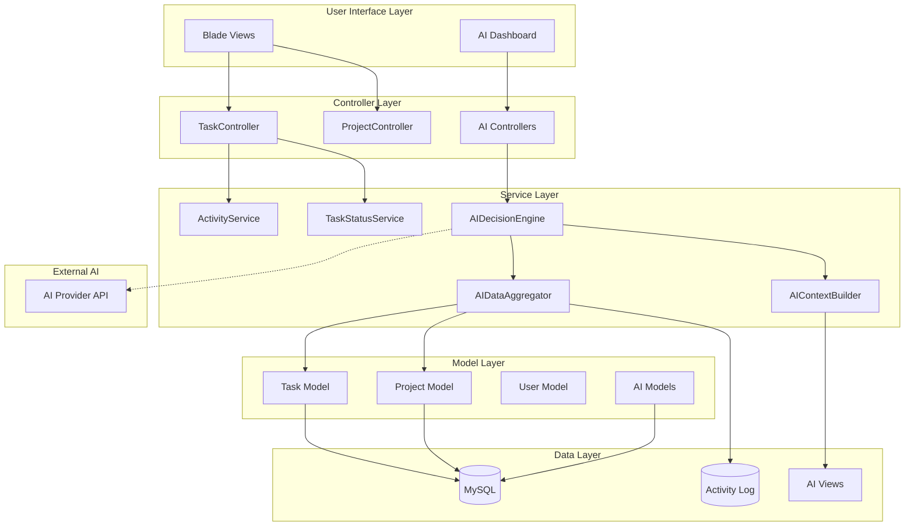
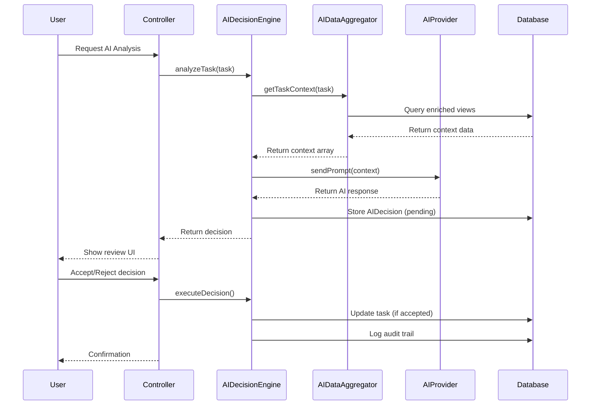

# AI Architecture Integration - Technical Documentation

**Document Version:** 1.0.0  
**Created:** 2026-01-07  
**Status:** Foundation Phase  
**Compatibility:** Laravel 11 + MySQL + Spatie Permission

---

## 1. EXECUTIVE SUMMARY

### 1.1 Integration Goal
Seamlessly integrate AI layer into existing Project Management System without disrupting current functionality, maintaining 100% backward compatibility while adding intelligent decision support capabilities.

### 1.2 Current System Overview

**Tech Stack:**
- **Framework:** Laravel 11
- **Database:** MySQL
- **Authentication:** Laravel Sanctum
- **Permissions:** Spatie Laravel-Permission
- **Activity Logging:** Spatie Laravel-Activity Log
- **Frontend:** Blade Templates + Bootstrap 5

**Existing Architecture:**
```
app/
├── Http/Controllers/
│   ├── Auth/                    # Authentication controllers
│   ├── Management/              # Business logic controllers
│   │   ├── TaskController.php   # Task CRUD + operations
│   │   ├── ProjectController.php
│   │   ├── UserController.php
│   │   └── ...
│   └── HomeController.php
├── Models/
│   ├── Task.php                 # Rich domain model with scopes
│   ├── Project.php
│   ├── User.php
│   └── Task*/Project* (related)
├── Services/
│   ├── ActivityService.php      # Activity logging wrapper
│   ├── TaskStatusService.php    # Business rules for status
│   └── AI/                      # NEW: AI services
└── Enums/
    ├── TaskStatus.php
    └── TaskPriority.php
```

---

## 2. CURRENT SYSTEM ANALYSIS

### 2.1 Controllers Analysis

**TaskController.php** (Management/TaskController.php)
- **Purpose:** Complete task lifecycle management
- **Methods:**
  - `index()` - List with filters/search/pagination
  - `kanban()` - Kanban board view
  - `create()` / `store()` - Creation flow
  - `show()` / `edit()` / `update()` - View/edit
  - `destroy()` - Soft delete
  - `storeComment()` / `storeAttachment()` / `storeSubTask()` - Relations
  - `storeTimeEntry()` - Time tracking

**Integration Points:**
- ✅ Can inject AI services via constructor
- ✅ Already uses Request validation (can extend for AI)
- ✅ Returns views (can add AI decision cards)
- ⚠️ No AI hooks yet (need to add trigger points)

### 2.2 Models Analysis

**Task.php Model** - Rich Domain Model
- **Relationships:** project, creator, assignedUsers, attachments, comments, tags, subTasks, timeEntries
- **Scopes:** status, priority, search, overdue, dueSoon, active, completed
- **Business Logic:**
  - `isOverdue()` - Returns boolean
  - `getDaysOverdue()` - Returns int
  - `getUrgencyLevel()` - Returns string (critical/high/medium/normal)
  - `isDueSoon()` - Returns boolean
- **Activity Log:** Fully integrated with Spatie Activity Log
  - Logs: title, description, status, priority, due_date, client_name, project_id
  - Rich context: IP, user_agent, urgency, overdue status

**Integration Points:**
- ✅ Perfect foundation for AI analysis
- ✅ Already has business logic methods (can feed AI)
- ✅ Activity log provides rich historical context
- ✅ Scopes make data querying easy

### 2.3 Services Analysis

**ActivityService.php**
- **Purpose:** Centralized activity logging
- **Methods:**
  - `logTaskCreated()` / `logTaskUpdated()`
  - `getSimilarTasks()` - Finds similar completed tasks
  - `getTaskActivities()` - Retrieves activity history

**TaskStatusService.php**
- **Purpose:** Business rules for task status transitions
- **Methods:**
  - `canTransition()` - Validates status changes
  - `getAllowedTransitions()` - Returns valid next statuses

**Integration Points:**
- ✅ Services already use dependency injection
- ✅ Can create parallel AI services under `app/Services/AI/`
- ✅ Can hook into existing services for data

### 2.4 Spatie Permission Integration

**Current Permissions Structure:**
```php
Permissions:
- view-users, create-users, edit-users, delete-users
- view-roles, create-roles, edit-roles, delete-roles
- view-permissions, create-permissions, edit-permissions, delete-permissions
- view-projects, create-projects, edit-projects, delete-projects
- view-tasks, create-tasks, edit-tasks, delete-tasks
- view-activity-logs, export-activity-logs, manage-activity-logs

Roles:
- Super Admin (all permissions)
- Admin
- Manager  
- User
```

**Integration Strategy:**
- ✅ Add new AI-specific permissions (8 new)
- ✅ Assign to Super Admin by default
- ✅ Use existing middleware patterns
- ✅ No changes to current permission structure

---

## 3. AI LAYER ARCHITECTURE

### 3.1 Directory Structure (NEW)

```
app/
├── Http/Controllers/
│   └── Admin/
│       └── AI/                          # NEW
│           ├── AIControlController.php
│           ├── AIPromptController.php
│           ├── AIDecisionController.php
│           ├── AIDecisionReviewController.php
│           ├── AIInsightsController.php
│           ├── AIAnalyticsController.php
│           ├── AISafetyController.php
│           └── AIFeaturesController.php
├── Models/
│   └── AI/                              # NEW
│       ├── AIDecision.php
│       ├── AIPrompt.php
│       ├── AISetting.php
│       └── AIAuditLog.php
├── Services/
│   └── AI/                              # EXISTING (partially)
│       ├── AISettingsService.php
│       ├── AIMetricsService.php
│       ├── Data/
│       │   ├── AIDataAggregator.php
│       │   └── AIContextBuilder.php
│       ├── Engine/
│       │   ├── AIDecisionEngine.php
│       │   ├── AIResponseParser.php
│       │   └── AIDecisionValidator.php
│       ├── Prompts/
│       │   ├── AIPromptTemplate.php
│       │   └── PromptVersionManager.php
│       ├── Safety/
│       │   ├── AIGuardrails.php
│       │   └── AIFallbackHandler.php
│       └── Metrics/
│           └── AIMetricsCollector.php
├── Contracts/                           # NEW
│   └── AIProvider.php
└── Http/Middleware/
    └── CheckAIPermission.php            # NEW
```

### 3.2 Component Diagram



### 3.3 Data Flow



---

## 4. INTEGRATION STRATEGY

### 4.1 Zero-Disruption Principles

1. **No Existing Code Modification**
   - AI layer sits alongside existing code
   - Uses dependency injection (no hard coupling)
   - Existing controllers/models unchanged

2. **Namespace Segregation**
   - All AI code under `AI/` namespaces
   - Clear separation: `app/Http/Controllers/Admin/AI/*`
   - Easy to enable/disable entire AI layer

3. **Database Isolation**
   - New tables with `ai_` prefix
   - Foreign keys to existing tables (tasks, projects, users)
   - Can be removed without affecting core tables

4. **Route Segregation**
   - New file: `routes/ai.php`
   - Prefix: `/admin/ai/*`
   - Separate middleware group

### 4.2 Integration Points

**Point 1: TaskController**
```php
// BEFORE (existing)
public function store(StoreTaskRequest $request) {
    $task = Task::create($validated);
    return redirect()->route('tasks.show', $task);
}

// AFTER (with optional AI hook)
public function store(StoreTaskRequest $request) {
    $task = Task::create($validated);
    
    // Optional: Trigger AI analysis (non-blocking)
    if (config('ai.enabled')) {
        dispatch(new AnalyzeTaskJob($task));
    }
    
    return redirect()->route('tasks.show', $task);
}
```

**Point 2: Activity Log**
- Already logging events
- AI can consume activity_log table
- No changes needed to existing logging

**Point 3: Models**
- Models already have business logic methods
- AI services can call these methods
- No model changes required

### 4.3 Dependency Injection Strategy

**Service Provider Registration:**
```php
// app/Providers/AIServiceProvider.php
public function register() {
    // Bind interfaces to implementations
    $this->app->bind(AIProvider::class, function () {
        return match(config('ai.provider')) {
            'openai' => new OpenAIProvider(),
            'gemini' => new GeminiProvider(),
            default => new MockAIProvider(),
        };
    });
    
    // Singleton services
    $this->app->singleton(AIDecisionEngine::class);
    $this->app->singleton(AIDataAggregator::class);
    $this->app->singleton(AISettingsService::class);
}
```

---

## 5. INTERFACE CONTRACTS

### 5.1 AIProvider Interface

```php
namespace App\Contracts;

interface AIProvider
{
    public function analyze(string $prompt, array $context): array;
    public function getModelName(): string;
    public function getMaxTokens(): int;
    public function isAvailable(): bool;
}
```

### 5.2 AIDecisionEngine Contract

```php
namespace App\Services\AI\Engine;

class AIDecisionEngine
{
    public function analyzeTask(Task $task): AIDecision;
    public function createProjectPlan(Project $project): AIDecision;
    public function breakdownToTasks(array $requirements): AIDecision;
    public function executeDecision(AIDecision $decision): bool;
}
```

---

## 6. ERROR HANDLING STRATEGY

### 6.1 Graceful Degradation

```php
try {
    $decision = $this->aiEngine->analyzeTask($task);
} catch (AIProviderException $e) {
    // Log error
    Log::error('AI analysis failed', [
        'task_id' => $task->id,
        'error' => $e->getMessage()
    ]);
    
    // Return safe fallback
    $decision = new AIDecision([
        'recommendation_type' => 'manual_review_required',
        'confidence_score' => 0,
        'reasoning' => 'AI analysis unavailable. Manual review recommended.',
        'fallback' => true
    ]);
}

// System continues working normally
```

### 6.2 Error Levels

- **Level 1 (AI Provider Down):** System works normally, no AI features
- **Level 2 (Data Issues):** AI returns low confidence, user reviews manually
- **Level 3 (Validation Fails):** Decision rejected, logged for improvement
- **Level 4 (Guardrail Violation):** Decision blocked, alert sent

---

## 7. PERFORMANCE CONSIDERATIONS

### 7.1 Caching Strategy

```php
// Settings cache (1 hour)
Cache::remember("ai_setting_{$key}", 3600, function() { ... });

// Context cache (15 minutes - projects)
Cache::remember("ai_project_context_{$id}", 900, function() { ... });

// Context cache (10 minutes - tasks)
Cache::remember("ai_task_context_{$id}", 600, function() { ... });
```

### 7.2 Database Optimization

- **Views:** Pre-aggregated data (no JOIN at runtime)
- **Indexes:** Strategic indexes on `ai_decisions`, `ai_prompts`
- **Partitioning:** Consider partitioning `ai_audit_logs` by date

### 7.3 Async Processing

```php
// Non-blocking AI analysis
dispatch(new AnalyzeTaskJob($task))->onQueue('ai-analysis');

// Background decision execution
dispatch(new ExecuteDecisionJob($decision))->onQueue('ai-execution');
```

---

## 8. TESTING STRATEGY

### 8.1 Unit Tests

```php
tests/Unit/
├── AIDataAggregatorTest.php
├── AIDecisionEngineTest.php
├── AIGuardrailsTest.php
└── AIPromptTemplateTest.php
```

### 8.2 Feature Tests

```php
tests/Feature/
├── AIWorkflowTest.php (end-to-end)
├── AIDecisionReviewTest.php
└── AIPermissionsTest.php
```

### 8.3 Mock AI Provider

```php
class MockAIProvider implements AIProvider
{
    public function analyze(string $prompt, array $context): array
    {
        return [
            'recommendation' => 'Increase priority to HIGH',
            'confidence' => 0.85,
            'reasoning' => 'Task is overdue by 3 days...',
        ];
    }
}
```

---

## 9. ROLLBACK STRATEGY

### 9.1 Quick Disable

```bash
# Disable AI system
php artisan tinker
>>> AISetting::updateOrCreate(['key' => 'ai_enabled'], ['value' => false]);
```

### 9.2 Full Rollback

```bash
# Rollback migrations (in reverse order)
php artisan migrate:rollback --step=5

# Remove routes
# Comment out: require __DIR__.'/ai.php' in routes/web.php

# Remove permissions
php artisan tinker
>>> Permission::where('name', 'like', '%-ai-%')->delete();
```

### 9.3 Data Preservation

- Soft deletes on `ai_decisions`
- Keep `ai_audit_logs` for compliance
- Can archive and remove later

---

## 10. SECURITY CHECKLIST

- [ ] All AI endpoints require authentication
- [ ] Permission checks on every AI operation
- [ ] Input validation on all AI requests
- [ ] Rate limiting on AI API calls
- [ ] SQL injection prevention in dynamic queries
- [ ] XSS prevention in AI output display
- [ ] CSRF tokens on all AI forms
- [ ] Audit logging for all AI decisions
- [ ] IP tracking for sensitive operations
- [ ] No sensitive data in AI prompts (mask if needed)

---

## 11. CONFIGURATION

### 11.1 AI Config File

```php
// config/ai.php
return [
    'enabled' => env('AI_ENABLED', false),
    'provider' => env('AI_PROVIDER', 'mock'), // openai, gemini, mock
    'api_key' => env('AI_API_KEY'),
    'model' => env('AI_MODEL', 'gpt-4'),
    'max_tokens' => env('AI_MAX_TOKENS', 2000),
    'temperature' => env('AI_TEMPERATURE', 0.7),
    'timeout' => env('AI_TIMEOUT', 30), // seconds
    
    'cache' => [
        'settings_ttl' => 3600, // 1 hour
        'context_ttl' => 600,   // 10 minutes
    ],
    
    'guardrails' => [
        'max_priority_jump' => 2,
        'min_confidence' => 0.6,
        'max_actions_per_decision' => 5,
    ],
];
```

---

## 12. DEPLOYMENT CHECKLIST

### 12.1 Pre-Deployment

- [ ] Run all tests (`php artisan test`)
- [ ] Check migrations (`php artisan migrate:status`)
- [ ] Verify permissions seeded
- [ ] Test with mock AI provider
- [ ] Review security checklist

### 12.2 Deployment Steps

1. Backup database
2. Run migrations
3. Seed AI permissions
4. Clear cache
5. Test AI dashboard access
6. Enable AI system (if ready)

### 12.3 Post-Deployment

- [ ] Monitor error logs
- [ ] Check AI decision creation
- [ ] Verify permission checks working
- [ ] Test fallback scenarios
- [ ] Monitor performance metrics

---

## 13. MAINTENANCE

### 13.1 Monitoring

```php
// Health check endpoint
GET /admin/ai/health

Response:
{
    "status": "healthy",
    "provider": "openai",
    "response_time_avg": 1500, // ms
    "fallback_rate": 2, // %
    "error_count_24h": 0
}
```

### 13.2 Logs

```bash
# AI specific logs
storage/logs/ai.log

# Standard Laravel log (AI errors also logged here)
storage/logs/laravel.log
```

---

**Document Status:** ✅ Ready for Implementation  
**Last Updated:** 2026-01-07  
**Next Step:** Create database migrations (Task 1.2)
