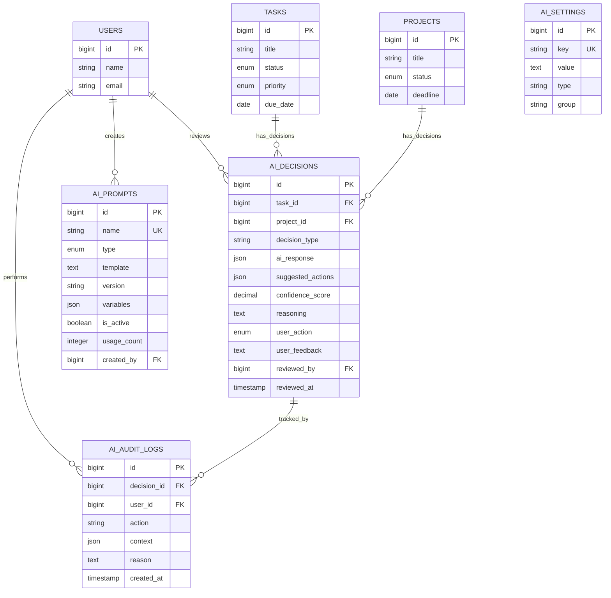

# AI Layer Database Schema Documentation

**Version:** 1.0.0  
**Created:** 2026-01-07  
**Database:** MySQL 8.0+  
**Total Tables:** 4

---

## Overview

The AI layer database schema consists of 4 specialized tables designed to support intelligent decision-making, prompt management, system configuration, and comprehensive audit trails.

### Design Principles

1. **Normalized Structure** - 3NF compliance for data integrity
2. **Foreign Key Relationships** - Cascade deletes where appropriate
3. **Strategic Indexing** - Performance-optimized queries
4. **JSON Flexibility** - Dynamic data storage for AI responses
5. **Soft Deletes** - Data recovery capability (where needed)
6. **Immutable Audit** - Permanent logging of user actions

---

## Table 1: `ai_decisions`

### Purpose
Stores AI-generated decisions, recommendations, and their lifecycle (pending → accepted/rejected).

### Schema

| Column | Type | Constraints | Description |
|--------|------|-------------|-------------|
| `id` | BIGINT UNSIGNED | PRIMARY KEY, AUTO_INCREMENT | Unique decision identifier |
| `task_id` | BIGINT UNSIGNED | NULLABLE, FK → tasks(id) CASCADE | Related task (if applicable) |
| `project_id` | BIGINT UNSIGNED | NULLABLE, FK → projects(id) CASCADE | Related project (if applicable) |
| `decision_type` | VARCHAR(50) | NOT NULL | Type: task_analysis, project_breakdown, priority_suggestion |
| `ai_response` | JSON | NOT NULL | Complete AI provider response |
| `suggested_actions` | JSON | NOT NULL | Specific actionable items |
| `confidence_score` | DECIMAL(3,2) | NOT NULL | AI confidence (0.00 to 1.00) |
| `reasoning` | TEXT | NOT NULL | AI's explanation/reasoning |
| `user_action` | ENUM | NOT NULL, DEFAULT 'pending' | pending, accepted, rejected, modified |
| `user_feedback` | TEXT | NULLABLE | User's reason for accept/reject |
| `reviewed_by` | BIGINT UNSIGNED | NULLABLE, FK → users(id) SET NULL | User who reviewed |
| `reviewed_at` | TIMESTAMP | NULLABLE | When reviewed |
| `created_at` | TIMESTAMP | NOT NULL | When decision created |
| `updated_at` | TIMESTAMP | NOT NULL | Last modified |
| `deleted_at` | TIMESTAMP | NULLABLE | Soft delete timestamp |

### Indexes

```sql
PRIMARY KEY (id)
FOREIGN KEY (task_id) REFERENCES tasks(id) ON DELETE CASCADE
FOREIGN KEY (project_id) REFERENCES projects(id) ON DELETE CASCADE
FOREIGN KEY (reviewed_by) REFERENCES users(id) ON DELETE SET NULL
INDEX idx_task_decision_type (task_id, decision_type)
INDEX idx_project_decision_type (project_id, decision_type)
INDEX idx_user_action (user_action)
INDEX idx_created_at (created_at)
INDEX idx_confidence (confidence_score)
```

### Sample Data

```json
{
  "id": 1,
  "task_id": 42,
  "project_id": null,
  "decision_type": "task_analysis",
  "ai_response": {
    "recommendation": "Increase priority to HIGH",
    "alternative_actions": ["Extend deadline", "Add more resources"],
    "risk_assessment": "medium"
  },
  "suggested_actions": [
    {
      "action": "update_priority",
      "from": "medium",
      "to": "high"
    }
  ],
  "confidence_score": 0.87,
  "reasoning": "Task is overdue by 3 days and blocking 2 other tasks...",
  "user_action": "pending",
  "user_feedback": null,
  "reviewed_by": null,
  "reviewed_at": null
}
```

---

## Table 2: `ai_prompts`

### Purpose
Stores reusable AI prompt templates with version control, allowing dashboard-based editing and A/B testing.

### Schema

| Column | Type | Constraints | Description |
|--------|------|-------------|-------------|
| `id` | BIGINT UNSIGNED | PRIMARY KEY, AUTO_INCREMENT | Unique prompt identifier |
| `name` | VARCHAR(100) | UNIQUE, NOT NULL | Prompt name: system_prompt, task_analysis_v1 |
| `type` | ENUM | NOT NULL | system, user, assistant |
| `template` | TEXT | NOT NULL | Actual prompt with {{variables}} |
| `version` | VARCHAR(20) | NOT NULL, DEFAULT '1.0.0' | Semantic versioning |
| `variables` | JSON | NULLABLE | Available variables metadata |
| `description` | TEXT | NULLABLE | What this prompt does |
| `is_active` | BOOLEAN | NOT NULL, DEFAULT TRUE | Currently in use? |
| `usage_count` | INTEGER | NOT NULL, DEFAULT 0 | Times used (incremented) |
| `created_by` | BIGINT UNSIGNED | NOT NULL, FK → users(id) CASCADE | Creator user |
| `created_at` | TIMESTAMP | NOT NULL | When created |
| `updated_at` | TIMESTAMP | NOT NULL | Last modified |

### Indexes

```sql
PRIMARY KEY (id)
UNIQUE KEY (name)
FOREIGN KEY (created_by) REFERENCES users(id) ON DELETE CASCADE
INDEX idx_name_version (name, version)
INDEX idx_is_active (is_active)
INDEX idx_type (type)
```

### Sample Data

```json
{
  "id": 1,
  "name": "task_analysis_v2",
  "type": "system",
  "template": "Analyze the following task:\nTitle: {{task_title}}\nStatus: {{task_status}}\nPriority: {{task_priority}}\nDue: {{due_date}}\n\nProvide recommendations based on urgency and complexity.",
  "version": "2.0.0",
  "variables": {
    "task_title": "string",
    "task_status": "enum",
    "task_priority": "enum",
    "due_date": "date"
  },
  "description": "Main task analysis prompt with enhanced context",
  "is_active": true,
  "usage_count": 342,
  "created_by": 1
}
```

---

## Table 3: `ai_settings`

### Purpose
Flexible key-value configuration store for AI system settings, editable from dashboard without code changes.

### Schema

| Column | Type | Constraints | Description |
|--------|------|-------------|-------------|
| `id` | BIGINT UNSIGNED | PRIMARY KEY, AUTO_INCREMENT | Unique setting identifier |
| `key` | VARCHAR(100) | UNIQUE, NOT NULL | Setting key: ai_enabled, max_confidence |
| `value` | TEXT | NOT NULL | Setting value (cast by type) |
| `type` | VARCHAR(20) | NOT NULL | boolean, integer, string, json, float |
| `description` | TEXT | NULLABLE | What this setting controls |
| `group` | VARCHAR(50) | NOT NULL, DEFAULT 'general' | safety, performance, general |
| `created_at` | TIMESTAMP | NOT NULL | When created |
| `updated_at` | TIMESTAMP | NOT NULL | Last modified |

### Indexes

```sql
PRIMARY KEY (id)
UNIQUE KEY (key)
INDEX idx_group (group)
```

### Sample Data

```json
[
  {
    "key": "ai_enabled",
    "value": "true",
    "type": "boolean",
    "description": "Enable/disable entire AI system",
    "group": "general"
  },
  {
    "key": "max_confidence_threshold",
    "value": "0.6",
    "type": "float",
    "description": "Minimum confidence to auto-suggest",
    "group": "safety"
  },
  {
    "key": "max_priority_jump",
    "value": "2",
    "type": "integer",
    "description": "Max levels AI can change priority",
    "group": "safety"
  }
]
```

### Common Settings

| Key | Type | Default | Description |
|-----|------|---------|-------------|
| `ai_enabled` | boolean | false | Master AI switch |
| `ai_provider` | string | 'mock' | openai, gemini, mock |
| `max_confidence_threshold` | float | 0.6 | Min confidence for suggestions |
| `max_priority_jump` | integer | 2 | Max priority level change |
| `cache_ttl_settings` | integer | 3600 | Cache duration (seconds) |
| `cache_ttl_context` | integer | 600 | Context cache duration |
| `fallback_on_error` | boolean | true | Use fallback on AI failure |

---

## Table 4: `ai_audit_logs`

### Purpose
Immutable audit trail of all user interactions with AI decisions for compliance and learning.

### Schema

| Column | Type | Constraints | Description |
|--------|------|-------------|-------------|
| `id` | BIGINT UNSIGNED | PRIMARY KEY, AUTO_INCREMENT | Unique log identifier |
| `decision_id` | BIGINT UNSIGNED | NOT NULL, FK → ai_decisions(id) CASCADE | Related decision |
| `user_id` | BIGINT UNSIGNED | NOT NULL, FK → users(id) CASCADE | Acting user |
| `action` | VARCHAR(50) | NOT NULL | created, accepted, rejected, modified, viewed |
| `context` | JSON | NOT NULL | IP, user agent, changes, etc. |
| `reason` | TEXT | NULLABLE | User's stated reason |
| `created_at` | TIMESTAMP | NOT NULL, DEFAULT CURRENT_TIMESTAMP | When action occurred |

**Note:** No `updated_at` - audit logs are immutable.

### Indexes

```sql
PRIMARY KEY (id)
FOREIGN KEY (decision_id) REFERENCES ai_decisions(id) ON DELETE CASCADE
FOREIGN KEY (user_id) REFERENCES users(id) ON DELETE CASCADE
INDEX idx_decision_action (decision_id, action)
INDEX idx_user_id (user_id)
INDEX idx_created_at (created_at)
```

### Sample Data

```json
{
  "id": 1,
  "decision_id": 42,
  "user_id": 1,
  "action": "accepted",
  "context": {
    "ip": "192.168.1.100",
    "user_agent": "Mozilla/5.0...",
    "changes_made": {
      "priority": { "from": "medium", "to": "high" }
    },
    "time_to_review_seconds": 45
  },
  "reason": "Agreed with AI assessment - task is indeed blocking others",
  "created_at": "2026-01-07 21:15:30"
}
```

---

## Entity Relationship Diagram



---

## Data Flow Examples

### Example 1: AI Decision Lifecycle

```sql
-- 1. AI creates decision (pending)
INSERT INTO ai_decisions (
    task_id, decision_type, ai_response, 
    suggested_actions, confidence_score, reasoning, user_action
) VALUES (
    42, 'priority_suggestion', 
    '{"recommendation": "Increase to HIGH"}',
    '[{"action": "update_priority", "to": "high"}]',
    0.87, 
    'Task overdue and blocking others',
    'pending'
);

-- 2. User views decision (audit log)
INSERT INTO ai_audit_logs (decision_id, user_id, action, context)
VALUES (1, 5, 'viewed', '{"ip": "192.168.1.100"}');

-- 3. User accepts decision
UPDATE ai_decisions 
SET user_action = 'accepted', reviewed_by = 5, reviewed_at = NOW()
WHERE id = 1;

-- 4. Log acceptance
INSERT INTO ai_audit_logs (decision_id, user_id, action, context, reason)
VALUES (1, 5, 'accepted', '{"ip": "192.168.1.100"}', 'Agreed with assessment');

-- 5. Execute action on task
UPDATE tasks SET priority = 'high' WHERE id = 42;
```

### Example 2: Prompt Evolution

```sql
-- 1. Create v1 prompt
INSERT INTO ai_prompts (name, type, template, version, created_by)
VALUES ('task_analysis', 'system', 'Analyze: {{task_title}}', '1.0.0', 1);

-- 2. Use it many times (usage_count increments)
UPDATE ai_prompts SET usage_count = usage_count + 1 WHERE name = 'task_analysis';

-- 3. Create improved v2
INSERT INTO ai_prompts (name, type, template, version, is_active, created_by)
VALUES ('task_analysis', 'system', 'Enhanced prompt...', '2.0.0', true, 1);

-- 4. Disable v1
UPDATE ai_prompts SET is_active = false WHERE name = 'task_analysis' AND version = '1.0.0';
```

---

## Migration Commands

### Apply Migrations

```bash
# Check status
php artisan migrate:status

# Run migrations
php artisan migrate

# Rollback last batch
php artisan migrate:rollback

# Rollback all AI tables
php artisan migrate:rollback --step=4

# Fresh start (DANGER: deletes all data)
php artisan migrate:fresh
```

### Seed Default Data

```bash
# Seed AI permissions and settings
php artisan db:seed --class=AIPermissionsSeeder
php artisan db:seed --class=AIDefaultSettingsSeeder
php artisan db:seed --class=AIDefaultPromptsSeeder
```

---

## Performance Optimization

### Query Examples

**Efficient Queries (using indexes):**

```sql
-- Fast: uses idx_user_action
SELECT * FROM ai_decisions WHERE user_action = 'pending';

-- Fast: uses idx_task_decision_type
SELECT * FROM ai_decisions 
WHERE task_id = 42 AND decision_type = 'task_analysis';

-- Fast: uses idx_confidence
SELECT * FROM ai_decisions WHERE confidence_score >= 0.8;

-- Fast: uses idx_is_active
SELECT * FROM ai_prompts WHERE is_active = true;
```

**Avoid Full Table Scans:**

```sql
-- Slow: no index on reasoning (full text search needed)
SELECT * FROM ai_decisions WHERE reasoning LIKE '%deadline%';

-- Better: filter first, then search
SELECT * FROM ai_decisions 
WHERE task_id = 42 AND reasoning LIKE '%deadline%';
```

### Index Usage Statistics

```sql
-- Check index usage (MySQL)
SHOW INDEX FROM ai_decisions;

-- Analyze query performance
EXPLAIN SELECT * FROM ai_decisions WHERE user_action = 'pending';
```

---

## Storage Estimates

### Table Size Projections

Based on 1000 tasks/month:

| Table | Rows/Month | Avg Row Size | Monthly Growth |
|-------|------------|--------------|----------------|
| `ai_decisions` | ~1,500 | 2 KB | ~3 MB |
| `ai_prompts` | ~10 | 1 KB | ~10 KB |
| `ai_settings` | ~20 | 500 B | ~10 KB |
| `ai_audit_logs` | ~6,000 | 500 B | ~3 MB |

**Total Monthly Growth:** ~6 MB  
**Annual Growth:** ~72 MB

**Retention Policy:**
- `ai_decisions`: Keep all (soft delete)
- `ai_audit_logs`: Archive after 1 year
- `ai_prompts`: Keep all versions
- `ai_settings`: Keep all history

---

## Security Considerations

### Data Protection

1. **Sensitive Data Masking**
   ```php
   // Before sending to AI
   $task_description = maskSensitiveData($task->description);
   ```

2. **Audit Trail Integrity**
   - `ai_audit_logs` has no UPDATE - only INSERT
   - Timestamp immutable via database constraint

3. **Foreign Key Constraints**
   - Prevent orphaned records
   - Cascade deletes where appropriate
   - SET NULL for user references (compliance)

### Access Control

All tables accessible only through:
- Authenticated users
- Permission-checked controllers
- Validated requests
- Audit-logged actions

---

## Maintenance

### Regular Tasks

**Weekly:**
```sql
-- Check orphaned records
SELECT COUNT(*) FROM ai_decisions WHERE task_id NOT IN (SELECT id FROM tasks);

-- Monitor growth
SELECT 
    TABLE_NAME,
    ROUND(((DATA_LENGTH + INDEX_LENGTH) / 1024 / 1024), 2) AS 'Size in MB'
FROM information_schema.TABLES
WHERE TABLE_SCHEMA = DATABASE() AND TABLE_NAME LIKE 'ai_%';
```

**Monthly:**
```sql
-- Archive old audit logs (optional)
INSERT INTO ai_audit_logs_archive 
SELECT * FROM ai_audit_logs 
WHERE created_at < DATE_SUB(NOW(), INTERVAL 1 YEAR);

-- Analyze tables for optimization
ANALYZE TABLE ai_decisions, ai_prompts, ai_settings, ai_audit_logs;
```

---

**Document Status:** ✅ Complete  
**Last Updated:** 2026-01-07  
**Next Review:** After initial production deployment
